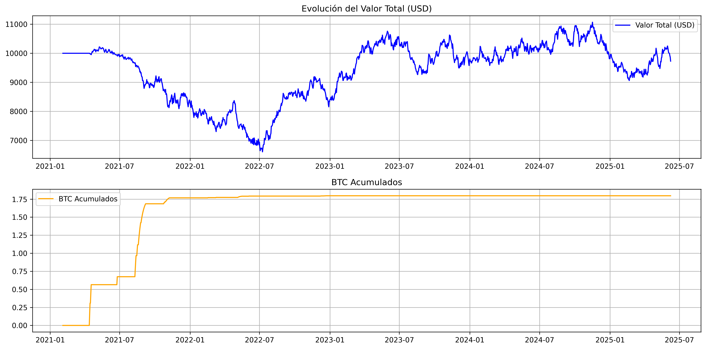

# btc-trading-bot

Bot modular para trading automático de Bitcoin (y otras cripto) con análisis técnico y backtesting integrado.

La estrategia actualmente recomendada, obtenida tras múltiples simulaciones y backtests, es una técnica de acumulación optimizada de BTC. A continuación se detallan sus principios y resultados.

## Estrategia de Acumulación de BTC

### Resumen de la Estrategia

Estrategia de acumulación de Bitcoin que utiliza indicadores técnicos para identificar oportunidades de compra en condiciones de sobreventa, con el objetivo de maximizar la cantidad de BTC acumulados a largo plazo.

### Características Principales

- **Enfoque en acumulación** de BTC en lugar de ganancias en USD
- **Señales de compra** basadas en RSI y Bandas de Bollinger
- **Gestión de riesgo** con tamaño de posición dinámico
- **Optimizada** para maximizar la acumulación de BTC

## Resultados del Backtest (2020-2025)

### Métricas Clave

| Métrica | Valor |
|---------|-------|
| BTC Acumulados | 1.7963 BTC |
| Retorno (USD) | -2.7% |
| Retorno (BTC) | +38.5% |
| Retorno HOLD (USD) | -23.7% |
| Máximo Drawdown | 35.3% |
| Ratio de Sharpe | 0.04 |
| Operaciones Totales | 66 |
| Comisiones Totales | $9.98 |

### Comparación con HOLD

- **+27.3% más BTC** que la estrategia HOLD (1.4108 BTC)
- **+21% mejor rendimiento en USD** que HOLD
- Menor volatilidad que el mercado

### Gráfico de Resultados



## Parámetros Óptimos

```python
{
    'rsi_oversold': 30,
    'bollinger_oversold': 0.08,  # 8% por debajo de la banda inferior
    'atr_multiplier': 3.0,      # Multiplicador para el stop loss dinámico
    'risk_per_trade': 0.005,    # 0.5% de riesgo por operación
    'min_rsi': 30,              # RSI mínimo para considerar compra
    'trend_filter': False       # Sin filtro de tendencia
}
```

## Instalación

1. Clona el repositorio:
   ```bash
   git clone https://github.com/tu-usuario/btc-trading-bot.git
   cd btc-trading-bot
   ```
2. Crea y activa un entorno virtual:
   ```bash
   python -m venv venv
   source venv/bin/activate  # en Windows usa venv\Scripts\activate
   ```
3. Instala las dependencias:
   ```bash
   pip install -r requirements.txt
   ```
4. Copia `.env.example` a `.env` y ajusta las variables necesarias.

## Ejecución rápida

- Ejecuta el setup automatizado:
  ```bash
  python setup_and_run.py
  ```
- Para el simulador abre el backend y el frontend en terminales separadas:
  ```bash
  uvicorn api.main:app --reload
  cd frontend && npm install && npm run dev
  ```
- Prueba la estrategia de acumulación en el endpoint `/api/portfolio/eval`.

## Backtesting y validación

- Existen varias estrategias en `backtests/`. Para evaluar o ajustar parámetros:
  ```bash
  python backtests/run_grid.py
  python backtests/ema_s2f_backtest.py
  ```
- Para comparar la estrategia con un DCA en distintos ciclos ejecuta:
  ```bash
  python -m backtests.multi_period_backtest_runner --csv resultados.csv
  ```
  El CSV generado en `results/` incluye columnas de riesgo como `max_drawdown`, `tiempo_en_perdida_pct` y `sharpe_ratio`.
- Usa `--sensitivity` para evaluar distintas combinaciones de RSI y Bollinger y `--plot` para guardar un gráfico comparativo.
- Los gráficos de cada backtest se guardan en `results/`; consulta `docs/monthly_backtest_guide.md` para más detalles y ejemplos.
- Para analizar compras adaptativas según el entorno de mercado ejecuta:
  ```bash
  python -m backtests.hybrid_trend_backtest_runner \
      --base 100 --factor-bull 200 --factor-bear 150 --fixed 50
  ```
  Donde `--factor-bull` y `--factor-bear` controlan el ajuste del aporte en entornos
  alcistas o bajistas, mientras que `--fixed` se usa cuando el mercado es neutral.
  El filtro de RSI se puede desactivar pasando `--rsi-threshold 0`.
  Con `--use-onchain` se añaden las métricas de Glassnode (`sopr` y
  `exchange_net_flow`) para clasificar el entorno. Puedes indicar un CSV
  alternativo con `--onchain-csv ruta/al/archivo.csv` o usar las variables
  `EXCHANGE_NET_FLOW_CSV` y `SOPR_CSV`.

## API REST y Frontend

- Levanta la API con FastAPI:
  ```bash
  uvicorn api.main:app --reload
  ```
- Inicia el frontend con Vite:
  ```bash
  cd frontend
  npm install
  npm run dev
  ```
- Endpoints clave: `/api/prices/{coin_id}`, `/api/evaluations`, `/api/evaluation/export`.
- Componentes React principales: `StrategySimulator` y `EvaluationHistory`.

## Despliegue en producción

- Configura tus credenciales de exchange en `.env` (`EXCHANGE_API_KEY`, `EXCHANGE_SECRET`).
- Ejecuta el bot en tiempo real:
  ```bash
  python -m strategies.btc_accumulation_live --exchange binance --symbol BTC/USDT --initial-usd 1000
  ```
- Consulta los logs en `logs/btc_accumulation.log` y los reportes en `results/`.

## Guía para desarrollo y contribución

- Instala las herramientas de desarrollo y activa los hooks:
  ```bash
  pip install -r requirements-dev.txt
  pre-commit install
  ```
- Formatea y revisa el código antes de enviar PR:
  ```bash
  black .
  isort .
  flake8 --max-line-length=88 --extend-ignore=E203,W503
  pre-commit run --all-files
  ```
- Ejecuta backtests y pruebas unitarias para validar cambios.

## Base de datos y fixtures

- Inicializa la base de datos con Alembic:
  ```bash
  python tools/db.py init
  python tools/db.py upgrade
  ```
- Para trabajar sin conexión carga los fixtures locales:
  ```bash
  python -m tools.load_fixtures
  ```

## Licencia y contacto

MIT
